# ZoomCare Candidate Code Challenge - QA / Automation

## Part 1

## Test Case 1

* Test Scenario

A user navigates to the schedule page and gets available health providers.

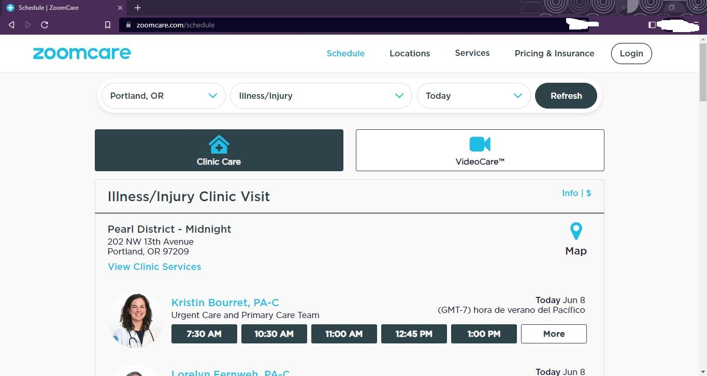

* Test Steps

1. Go to the schedule page <https://www.zoomcare.com/schedule>.

* Test Data

Not applicable.

* Expected Results

1. The title of the page is "Schedule | ZoomCare".
2. It shows fixed in the screen:
    1. The "Zoom Care" logo.
    2. A number of links to the main sections of the site:
        1. Schedule. It should be shown with light blue color.
        2. Locations.
        3. Services.
        4. Pricing & Insurance.
    3. A Login button.
3. It shows default search criteria in the filters:
    1. City: "Portland, OR".
    2. Service: "Illness/injury".
    3. Date: If there are no available health providers for today, it would show the next available date.
4. It shows the buttons "Clinic Care" and "VideoCare (TM)".
5. It shows a table with the header "Illness/Injury Clinic Visit" with the following information:
    1. There is a link named "Info | $".
    2. A list of clinics with the following:
        1. Name.
        2. Address.
        3. City and state code matching the search criteria. Postal code of the clinic.
        4. A marker link icon with the text "Map".
        5. A link named "View Clinic Services".
        6. A list of providers working in that clinic according to the search criteria:
            1. Provider photo.
            2. Provider name and title.
            3. Provider team.
            4. Availability date. It should match the search criteria month and date.
            5. Time zone according to the city and season.
            6. Up to 5 buttons with available times.
            7. A "More" button should be visible when the there are more than five available times.
6. The page footer. This section is the same all across the site.

## Test Case 2

* Test scenario

Unauthenticated user searches the first time slot and schedules it.


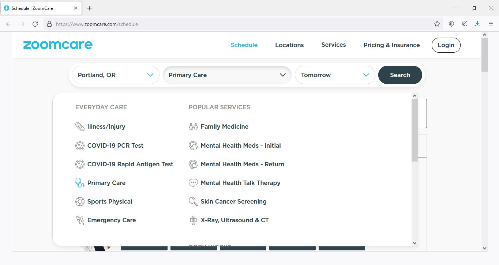

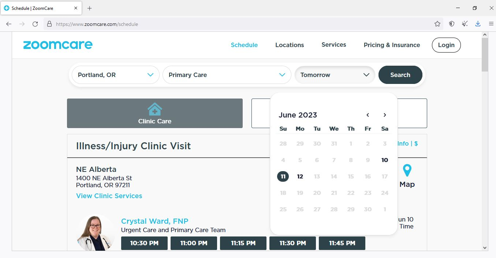

* Test Steps

1. Go to the schedule page <https://www.zoomcare.com/schedule>.
2. Click in the the first dropdown.
3. Select a city.
4. Click in the second dropdown.
5. Select a service.
6. Click in the third dropdown.
7. Select a date.
8. Click the "Refresh" button.
9. Click an available time slot.

* Test Data

1. City: "Seattle, WA".
2. Service: "Primary Care".
3. Date: "Tomorrow". Note that there may be no health providers for that date. In that case, find a date having providers available.

* Expected Results

The browser redirects to a login screen.

## Test Case 3

* Test scenario

Unauthenticated user search for a time slot and wants more info about a service.

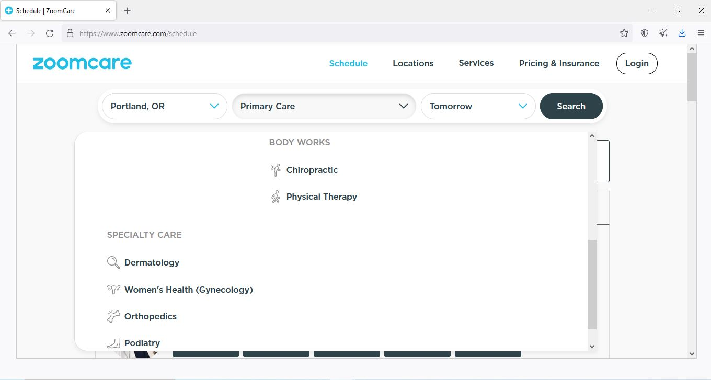

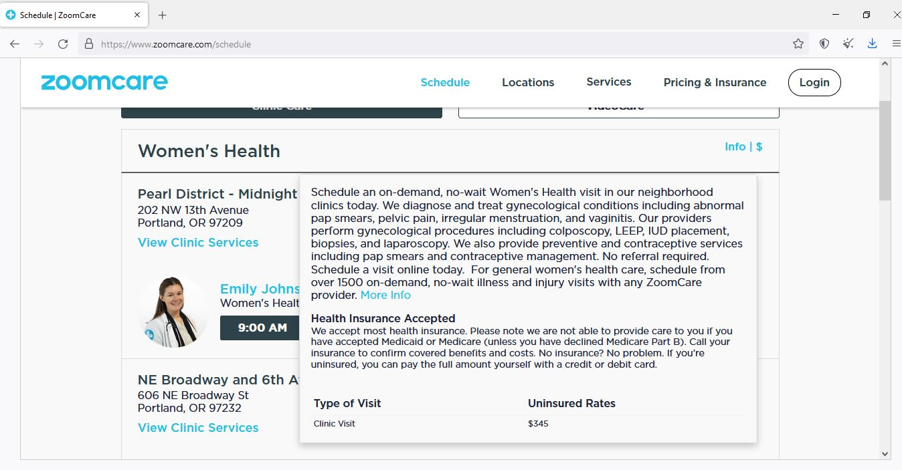

* Test Steps

1. Go to the schedule page <https://www.zoomcare.com/schedule>.
2. Click in the the first dropdown.
3. Select a city.
4. Click in the second dropdown.
5. Scroll down to the service name and click it.
6. Click in the third dropdown.
7. Select a date.
8. Click the "Refresh" button.
9. Click the "Info | $" text.

* Test Data

1. City: "Portland, OR".
2. Service: "Women health's (Ginecology)".

* Expected Results

It shows a popup with the following:

1. The service description.
2. A link "More Info" that targets to the service page.
3. Health insurance accepted, if any.
4. Type of visit
5. Uninsured rates.

It should disappear if clicked "Info | $" again.

## Test Case 4

* Test scenario

User navigates to the schedule page and wants to see health providers near the user location.  

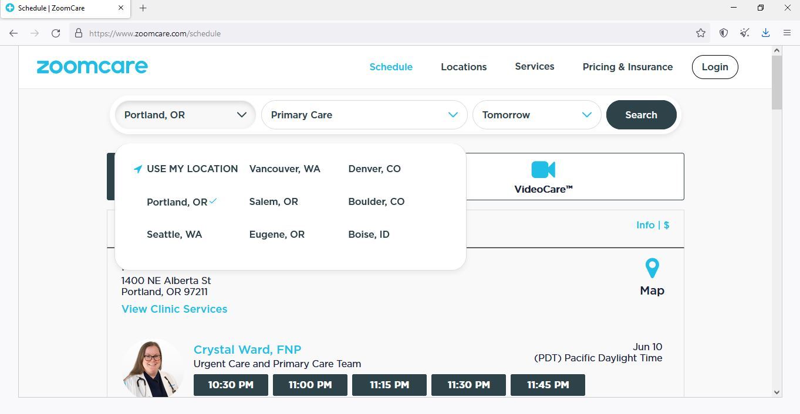

* Test Steps

1. Go to the schedule page <https://www.zoomcare.com/schedule>.
2. Click in the the first dropdown.
3. Click in "USE MY LOCATION".
4. Allow sharing your location in the browser.

* Test Data

1. Location: "101 NW 13th Avenue, Portland, OR".
2. Symptoms: "Illness/injury".

* Expected Results

It shows health providers near the user location.

## Test Case 5

* Test scenario

User navigates to the schedule page and wants to see where the clinic is in the map.  

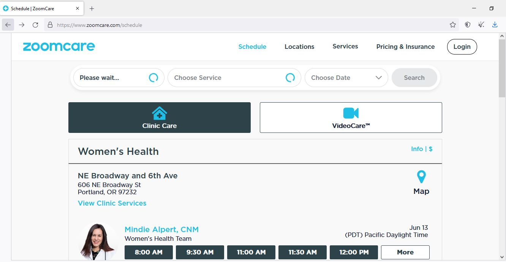

* Test Steps

1. Go to the schedule page <https://www.zoomcare.com/schedule>.
2. Click in the the "Map" text.

* Test Data

Not applicable.

* Expected Results

The browser opens a new tab with the Google Maps page showing a marker with the clinic address.

## Test Case 6

* Test scenario

Unauthenticated user search for a time slot and wants to know what services a clinic provides.

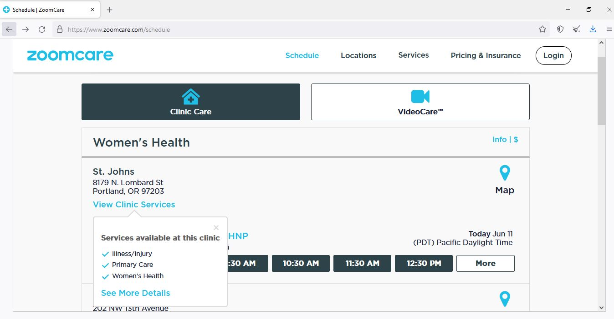

* Test Steps

1. Go to the schedule page <https://www.zoomcare.com/schedule>.
2. Click in the the first dropdown.
3. Select a city.
4. Click in the second dropdown.
5. Scroll down to the service name and click it.
6. Click in the third dropdown.
7. Select a date.
8. Click the "Refresh" button.
9. Click the "View Clinic Services" text.

* Test Data

1. City: "Portland, OR".
2. Service: "Women health's (Ginecology)".

* Expected Results

It shows a popup with the following:

1. A cross icon that allows closing the dialog.
2. A list of services available at that clinic.
3. A link "See More Details" that targets to a page with info about that clinic.

It should disappear if clicked the cross icon or the "View Clinic Services" again.

## Test Case 7

Unauthenticated user search the last available time slot.

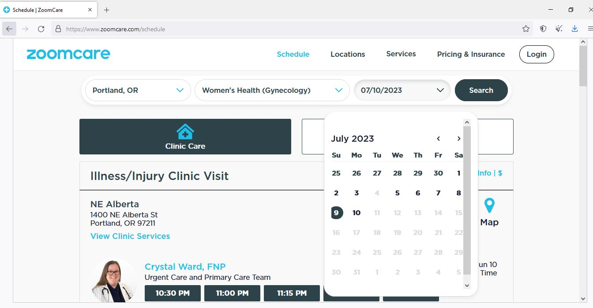

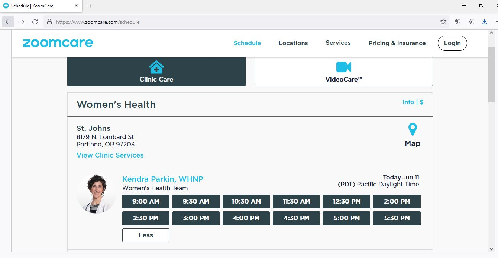

* Test Steps

1. Go to the schedule page <https://www.zoomcare.com/schedule>.
2. Click in the the first dropdown.
3. Select a city.
4. Click in the second dropdown.
5. Scroll down to the service name and click it.
6. Click in the third dropdown.
7. Click in the right arrow icon in order to see the next month dates.
8. Click in the last available date.
9. Click the "Refresh" button.
10. Click the first "More" button right to a time slot.

* Test Data

1. City: "Portland, OR".
2. Service: "Women health's (Ginecology)".

* Expected Results

It shows more available time slots for the health professional and provider.
It also shows a "Less" button that hides the latest time slots when clicked.

## Test Case 8

* Test scenario

Unauthenticated user search for the next available time slots for the desired clinic.

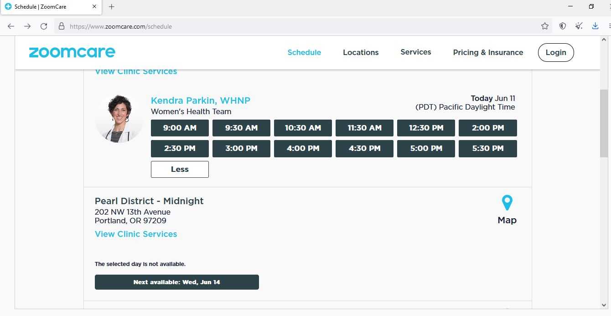

* Test Steps

1. Go to the schedule page <https://www.zoomcare.com/schedule>.
2. Click in the the first dropdown.
3. Select a city.
4. Click in the second dropdown.
5. Select a service.
6. Click the "Refresh" button.
7. Scroll down to the clinic without time slots available.
8. Click the "Next available:" button.

* Test Data

1. City: "Portland, OR".
2. Symptoms: "Woman's health (Ginecology)".
3. Date: "Today".
4. Clinic: "Pearl District - Midnight"

* Expected Results

The search filter date updates to the date in the "Next Available:" button. Then, it shows time slots for the desired clinic.

## Part 2

### Prerequisites in Windows
```
winget install OpenJS.NodeJS
```

### Installation
```
git clone https://github.com/lingottihx/candidate-project-qa-automation.git
npm i
npx playwright install
```

### Running test
```
npx playwright test
```
